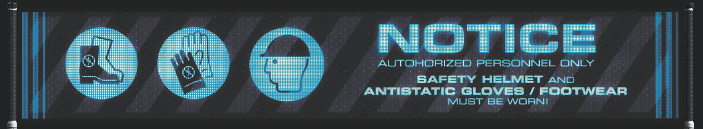

# 🏂 Zadan Fairuz
**`Code Wanderer (ML/DL & Data related fields)`**

I'm a curious individual and informatics student with a solid foundation in data analysis and machine learning, I derive immense satisfaction from analytics. My passion lies in observing and meticulously analyzing various phenomena, constantly seeking innovative solutions to complex problems. All coding projects across diverse facets of the data field are built from ground up, and some are my journey of learning from scratch.

- 🎲 I’m currently learning **Linear Algebra : Mathemathics for Machine Learning**

- 📫 Reach me **zadanfaidelta@gmail.com**

## 💻 Tech Stack:
                                       

## 📊 GitHub Stats:

<h3>💻 GitHub Profile Stats</h3>

 

<h3>🔥 Streak Stats</h3>

### 🔝 Top Contributed Repo

<b>Note:</b> Top languages is only a metric of the languages my public code consists of and doesn't reflect experience or skill level.

---

